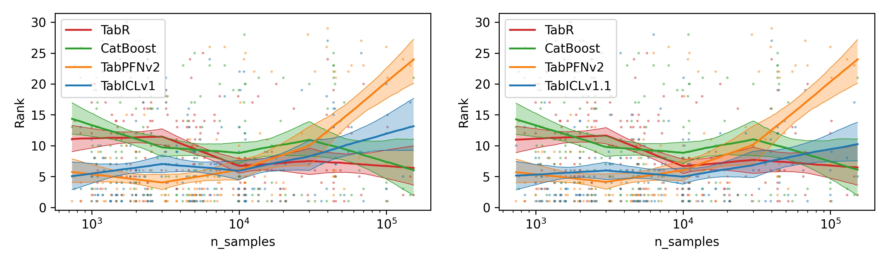
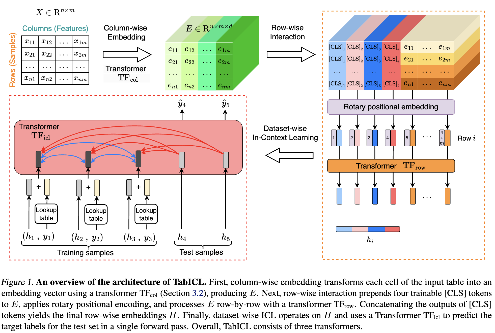
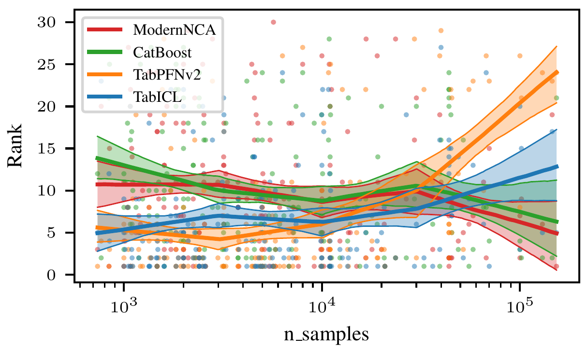
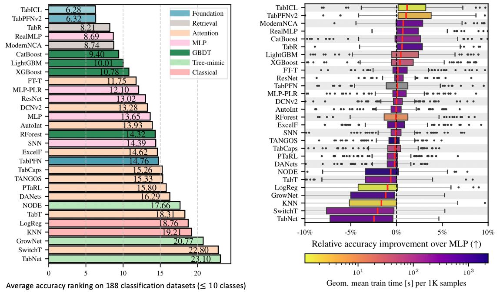

[](https://github.com/soda-inria/tabicl/actions/workflows/testing.yml)
[](https://badge.fury.io/py/tabicl)
[](https://pypistats.org/packages/tabicl)

# TabICL: A Tabular Foundation Model for In-Context Learning on Large Data (ICML 2025)

This repo is the official implementation of ["TabICL: A Tabular Foundation Model for In-Context Learning on Large Data"](https://arxiv.org/pdf/2502.05564) as well as the follow-ups. TabICL is a tabular foundation model. Currently, it is only for classification tasks.

## Updates

***05/06/2025***

### Better-performing checkpoint 😄

We are continuously improving TabICL, and as a by-product (Great thanks to [David Holzmüller](https://github.com/dholzmueller)'s efforts !!!), we have a better-performing checkpoint. `TabICLClassifier` now accepts a new parameter `checkpoint_version` to specify which pretrained checkpoint to use. The available options are:

- `'tabicl-classifier-v1.1-0506.ckpt'` (default): The latest and best-performing version.
- `'tabicl-classifier-v1-0208.ckpt'`: The version used in the original TabICL paper. Use this if you need to reproduce the results reported in the paper.
- `'tabicl-classifier.ckpt'`: A legacy alias for `'tabicl-classifier-v1-0208.ckpt'` and will be removed in a future release.

<div style="margin-top: 30px;"></div>

<div style="margin-top: 30px;"></div>

<div style="margin-top: 30px;"></div>

<div style="margin-top: 30px;"></div>

***05/05/2025***

### Open-source pretraining code 🥳

After intensive refactoring, we fully open-sourced our pretraining code to reproduce our paper. The scripts folder provides the commands for [stage 1](./scripts/train_stage1.sh), [stage 2](./scripts/train_stage2.sh), and [stage 3](./scripts/train_stage3.sh) of curriculum learning.

***05/01/2025***

### Accepted to ICML 2025 🎉

## Architecture

TabICL processes tabular data through three sequential stages:

1. **Column-wise Embedding**: Creates distribution-aware embeddings for each feature
2. **Row-wise Interaction**: Captures interactions between features within each row
3. **Dataset-wise In-Context Learning**: Learns patterns from labeled examples to make predictions



## Installation

### From [PyPI](https://pypi.org/project/tabicl)

```bash
pip install tabicl
```

### From the source

#### Option 1: Installing `tabicl` from the Local Clone

```bash
cd tabicl; pip install -e .
```

#### Option 2: Installing `tabicl` Directly from the Git Remote

```bash
pip install git+https://github.com/soda-inria/tabicl.git
```

## Usage

### Basic Usage

```python
from tabicl import TabICLClassifier

clf = TabICLClassifier()
clf.fit(X_train, y_train)  # this is cheap
clf.predict(X_test)  # in-context learning happens here
```

The code above will automatically download the pre-trained checkpoint (~100MB) from Hugging Face Hub on first use and choose a GPU if available.

### Advanced Configuration

TabICL offers a set of parameters to customize its behavior. The following example shows all available parameters with their default values and brief descriptions:

```python
from tabicl import TabICLClassifier

clf = TabICLClassifier(
  n_estimators=32,                                        # number of ensemble members
  norm_methods=["none", "power"],                         # normalization methods to try
  feat_shuffle_method="latin",                            # feature permutation strategy
  class_shift=True,                                       # whether to apply cyclic shifts to class labels
  outlier_threshold=4.0,                                  # z-score threshold for outlier detection and clipping
  softmax_temperature=0.9,                                # controls prediction confidence
  average_logits=True,                                    # whether ensemble averaging is done on logits or probabilities
  use_hierarchical=True,                                  # enable hierarchical classification for datasets with many classe
  batch_size=8,                                           # process this many ensemble members together (reduce RAM usage)
  use_amp=True,                                           # use automatic mixed precision for faster inference
  model_path=None,                                        # where the model checkpoint is stored
  allow_auto_download=True,                               # whether automatic download to the specified path is allowed
  checkpoint_version="tabicl-classifier-v1.1-0506.ckpt",  # the version of pretrained checkpoint to use
  device=None,                                            # specify device for inference
  random_state=42,                                        # random seed for reproducibility
  n_jobs=None,                                            # number of threads to use for PyTorch
  verbose=False,                                          # print detailed information during inference
  inference_config=None,                                  # inference configuration for fine-grained control
)
```

## Memory-Efficient Inference

TabICL includes memory management to handle large datasets:

- **Memory Profiling**: Built-in memory estimators for different components of the model
- **Batch Size Estimation**: Dynamically determines optimal batch sizes based on available GPU memory
- **CPU Offloading**: Automatically offloads intermediate results to CPU when beneficial
- **OOM Recovery**: Recovers gracefully from out-of-memory errors by reducing batch size

## Preprocessing

### Simple built-in preprocessing
If the input `X` to TabICL is a pandas DataFrame, TabICL will automatically:
- Detect and ordinal encode categorical columns (including string, object, category, and boolean types)
- Create a separate category for missing values in categorical features
- Perform mean imputation for missing numerical values (encoded as NaN)

If the input `X` is a numpy array, TabICL assumes that ordinal encoding and missing value imputation have already been performed.

For both input types, TabICL applies additional preprocessing:
- Outlier detection and removal
- Feature scaling and normalization
- Feature shuffling for ensemble diversity

### Advanced data preprocessing with skrub 

Real-world datasets often contain complex heterogeneous data that benefits from more sophisticated preprocessing. For these scenarios, we recommend [skrub](https://skrub-data.org/stable/index.html), a powerful library designed specifically for advanced tabular data preparation.

**Why use skrub?**
- Handles diverse data types (numerical, categorical, text, datetime, etc.)
- Provides robust preprocessing for dirty data
- Offers sophisticated feature engineering capabilities
- Supports multi-table integration and joins

#### Installation

```bash
pip install skrub -U
```

#### Basic Integration

Use skrub's [TableVectorizer](https://skrub-data.org/stable/reference/generated/skrub.TableVectorizer.html) to transform your raw data before passing it to TabICLClassifier:

```python
from skrub import TableVectorizer
from tabicl import TabICLClassifier
from sklearn.pipeline import make_pipeline

pipeline = make_pipeline(
    TableVectorizer(),  # Automatically handles various data types
    TabICLClassifier()
)

pipeline.fit(X_train, y_train)  # X should be a DataFrame
predictions = pipeline.predict(X_test)
```


## Key Features and Considerations:

- **Number of samples**:
  - TabICL is pretrained on datasets with up to 60K samples.
  - TabICL can handle datasets beyond 100K samples thanks to memory-efficient inference.
  - TabPFN (v2) is on average better than TabICL on small datasets with <10K samples, while TabICL is better on larger datasets.
  - Classical methods may catch up with TabICL at around 40K samples but they are much slower due to extensive hyperparameter tuning.

<div style="margin-top: 30px;"></div>

<div style="margin-top: 30px;"></div>

- **Number of features**:
  - TabICL is pretrained on datasets with up to 100 features.
  - TabICL can accommodate any number of features theoretically.

- **Number of classes**:
  - TabICL is pretrained on datasets with up to 10 classes, so it natively supports a maximum of 10 classes.
  - However, TabICL can handle any number of classes thanks to its in-built hierarchical classification.

- **Inference speed**:
  - Like TabPFN, `fit()` does minimal work while `predict()` runs the full model
  - At the same `n_estimators`, TabICL is usually 1x-5x faster than TabPFN
  - TabICL benefits more from larger `n_estimators`, hence the default of 32
  - Automatic mixed precision (AMP) provides further speed improvements on compatible GPUs

- **No tuning required**: TabICL produces good predictions without hyperparameter tuning, unlike classical methods that require extensive tuning for optimal performance.

## Performance

TabICL has achieved excellent results on the [TALENT](https://github.com/qile2000/LAMDA-TALENT) benchmark.


<div style="margin-top: 30px;"></div>

## Citation
If you use TabICL for research purposes,
please cite our **[paper](https://arxiv.org/abs/2502.05564)**:
```bibtex
@article{qu2025tabicl,
  title={TabICL: A Tabular Foundation Model for In-Context Learning on Large Data},
  author={Qu, Jingang and Holzm{\"u}ller, David and Varoquaux, Ga{\"e}l and Morvan, Marine Le},
  journal={arXiv preprint arXiv:2502.05564},
  year={2025}
}
```

## Contributors

- [Jingang Qu](https://github.com/jingangQu)
- [David Holzmüller](https://github.com/dholzmueller)
- [Marine Le Morvan](https://github.com/marineLM)
